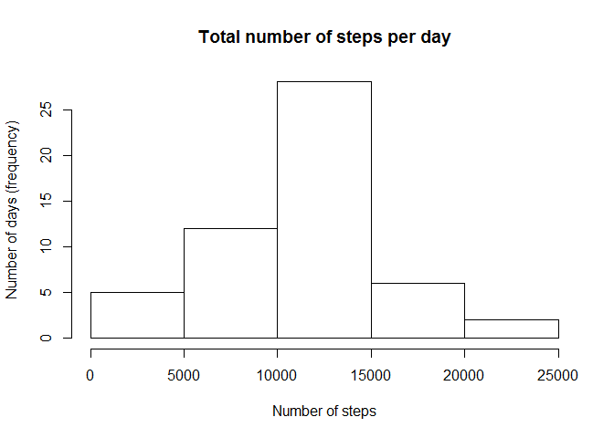
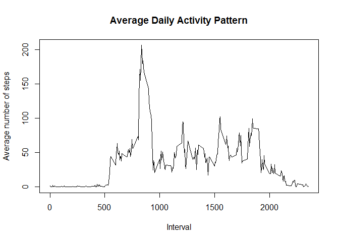
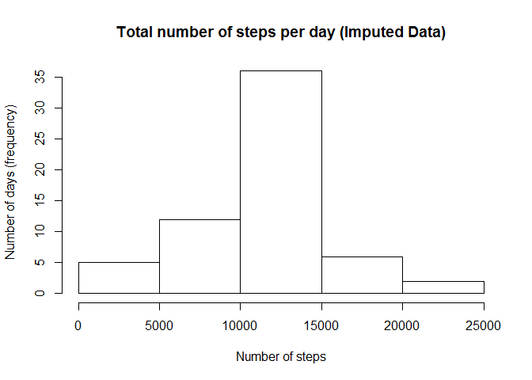

# Reproducible Research: Peer Assessment 1


## Loading and preprocessing the data

The data set for this assignment has the following data:

**steps**: Number of steps taking in a 5-minute interval (missing values are coded as NA)

**date**: The date on which the measurement was taken in YYYY-MM-DD format

**interval**: Identifier for the 5-minute interval in which measurement was taken

The dataset contains a total of 17,568 observations in this dataset.


First, we load input data from the current R working directory.


```r
# the lines below can be used to extract zip
fname = "activity.zip"
unzip(fname, files="activity.csv", overwrite=TRUE)

data <- read.csv("activity.csv", stringsAsFactors = FALSE)

# convert date column to date  type
data$date <- as.Date(data$date, "%Y-%m-%d")
```

The data contains NA values. **We will remove the NA values for the first part of this exercise**.

```r
# remove na values
dataModified <- na.omit(data)
```

Since most of the assignments deal with statistics around the number of steps, we will aggregate the data over a day first.


```r
# aggregate steps in a day
dataByDate <- aggregate(steps ~ date, dataModified, sum)
```


## What is mean total number of steps taken per day?


For this part of the assignment, **we will ignore the missing values in the dataset.**

**Step 1:** Calculate the total number of steps taken per day and make a histogram.


```r
hist(dataByDate$steps, xlab = "Number of steps", ylab="Number of days (frequency)", main = "Total number of steps per day")
```

 

**Step 2:** Calculate and report the mean and median of the total number of steps taken per day

**Mean**


```r
# get mean of total number of steps per day
mean(dataByDate$steps)
```

```
## [1] 10766.19
```

**Median**


```r
# get median total number of steps per day
median(dataByDate$steps)
```

```
## [1] 10765
```


## What is the average daily activity pattern?

**Step 1:** Make a time series plot (i.e.  type = "l" ) of the 5-minute interval (x-axis) and the average number of steps taken, averaged across all days (y-axis)


```r
# aggregate steps in intervals across all days
dataIntervalSteps <- aggregate(steps ~ interval, dataModified, mean)

# generate the line plot of the interval (x-axis) and the number of steps averaged (y-axis)
plot(dataIntervalSteps$interval, dataIntervalSteps$steps, type='l', main="Average Daily Activity Pattern", xlab="Interval", ylab="Average number of steps")
```

 


**Step 2:** Which 5-minute interval, on average across all the days in the dataset, contains the maximum number of steps?


```r
# get the row with maximum average number of steps in any given interval
maxAverageInIntervalRow <- which.max(dataIntervalSteps$steps)

# get the corresponding row from the table.
dataIntervalSteps [maxAverageInIntervalRow, ]
```

```
##     interval    steps
## 104      835 206.1698
```


## Imputing missing values


Note that there are a number of days/intervals where there are missing values (coded as NA). The presence of missing days may introduce bias into some calculations or summaries of the data.

###Step 1 : Calculate and report the total number of missing values in the dataset (i.e. the total number of rows with NAs)


```r
# get all rows with NAs
dataNAs <- data[!complete.cases(data),]

# calculate the number of rows
nrow(dataNAs)
```

```
## [1] 2304
```

### Step 2: Devise a strategy for filling in all of the missing values in the dataset. 

The imputation strategy we employ here is to use the mean for mean for that 5-minute interval, in place of NAs.

### Step 3: Create a new dataset that is equal to the original dataset but with the missing data filled in.**

```r
# We have the interval data already calculated.

# perform the imputation of NAs with interval mean
for (i in 1:nrow(data)){
  if (is.na(data$steps[i])){
    intervalValue <- data$interval[i]
    rowIndex <- which(dataIntervalSteps$interval == intervalValue)
    newSteps <- dataIntervalSteps$steps[rowIndex]
    data$steps[i] <- newSteps
  }
}
```

### Step 4: Make a histogram of the total number of steps taken each day and Calculate and report the mean and median total number of steps taken per day. 

Now we have imputed data set. We follow the steps as aggregation and historgram plot from initial exercise without imputation.


```r
# aggregate steps in a day
dataImputedByDate <- aggregate(steps ~ date, data, sum)
hist(dataImputedByDate$steps, xlab = "Number of steps", ylab="Number of days (frequency)", main = "Total number of steps per day (Imputed Data)")
```

 

Let's calculate and report the mean and median of total over a day.

**Mean**

```r
# get mean of total number of steps per day
mean(dataImputedByDate$steps)
```

```
## [1] 10766.19
```


**Median**

```r
# get median total number of steps per day
median(dataImputedByDate$steps)
```

```
## [1] 10766.19
```

### Step 5: Do these values differ from the estimates from the first part of the assignment? What is the impact of imputing missing data on the estimates of the total daily number of steps?
The mean doesn't change because we are using the mean from the intervals to impute. The median value has a change.

## Are there differences in activity patterns between weekdays and weekends?

**Steps 1:** Create a new factor variable in the dataset with two levels - "weekday" and "weekend" indicating whether a given date is a weekday or weekend day.


```r
# create a new column to the dataset indicating day of the week
data$day <- weekdays(data$date)

# create a new column called for day type
data$day.type <- c("weekday")

# create a weekend type for Saturday and Sunday
for (i in 1:nrow(data))
{
  if (data$day[i] == "Saturday" || data$day[i] == "Sunday")
  {
    data$day.type[i] <- "weekend"
  }
}

# convert day.time to factor
data$day.type <- as.factor(data$day.type)

# aggregate steps for each type of data
intervalStepsImputed <- aggregate(steps ~ interval+day.type, data, mean)

# plot using qplot. Needs ggplot2 library
library(ggplot2)
qplot(interval, steps, data=intervalStepsImputed, geom=c("line"), xlab="Interval", ylab="Number of steps", main="") + facet_wrap(~ day.type, ncol=1)
```

 

